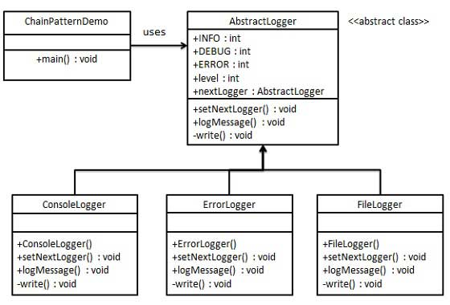

# Design Patterns Musings
Notes related to software design patterns.

## Behavioural
### Chain of Responsibility
[Best example](https://www.tutorialspoint.com/design_pattern/chain_of_responsibility_pattern.htm) I could find that is real world which I could understand the concept.

[image source](https://www.tutorialspoint.com/design_pattern/images/chain_pattern_uml_diagram.jpg)

A chain of loggers are created, a single log request is dispatched to the chain, the request is evaluated by each "worker" in the chain and may/may not be passed to the next "worker".

This pattern can be handy if you care about workers being called in sequence (chain of responsibility) over all workers being called at once (decorator).

[Said nicely here](https://stackoverflow.com/questions/747913/why-would-i-ever-use-a-chain-of-responsibility-over-a-decorator/747975):

Both decorators and chain of responsibility
> both use composition in favour of inheritance to provide a more flexible solution.

**Chain**

> Avoid coupling the sender of a request
> to its receiver by giving more than
> one object a chance to handle the
> request. Chain the receiving objects
> and pass the request along the chain
> until an object handles it.

vs

**Decorator**

> Attach additional responsibilities to
> an object dynamically. Decorators
> provide a flexible alternative to
> subclassing for extending
> functionality.
